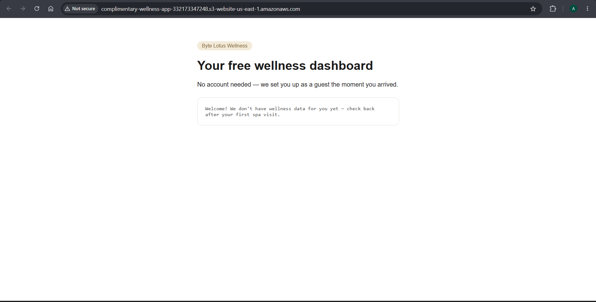
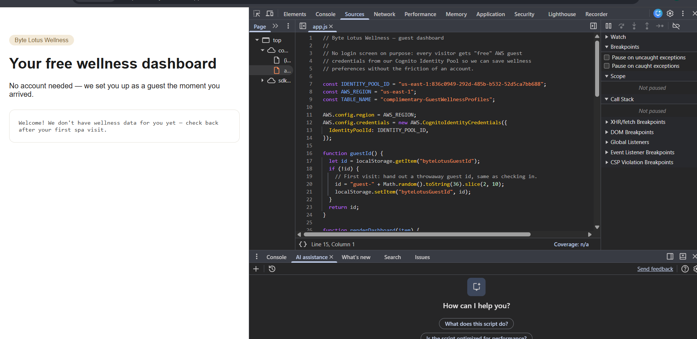
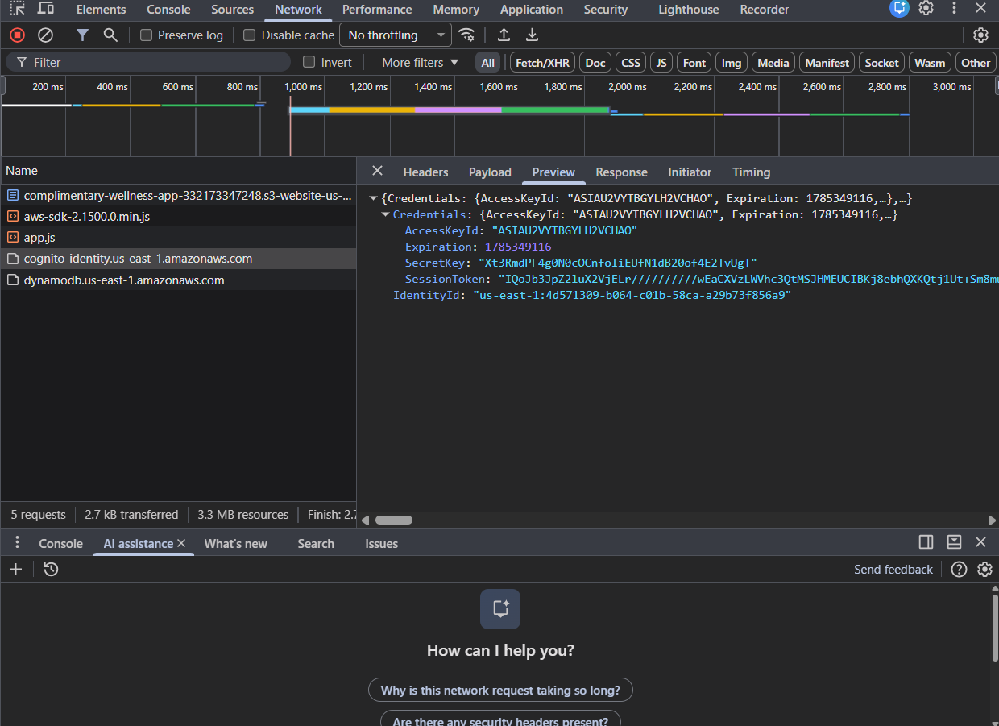
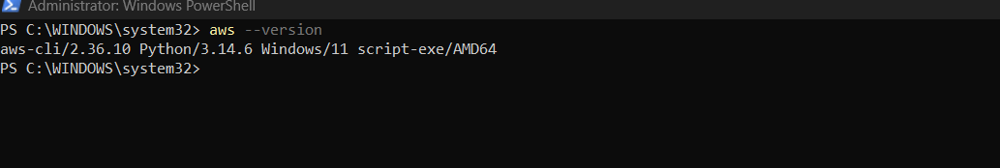
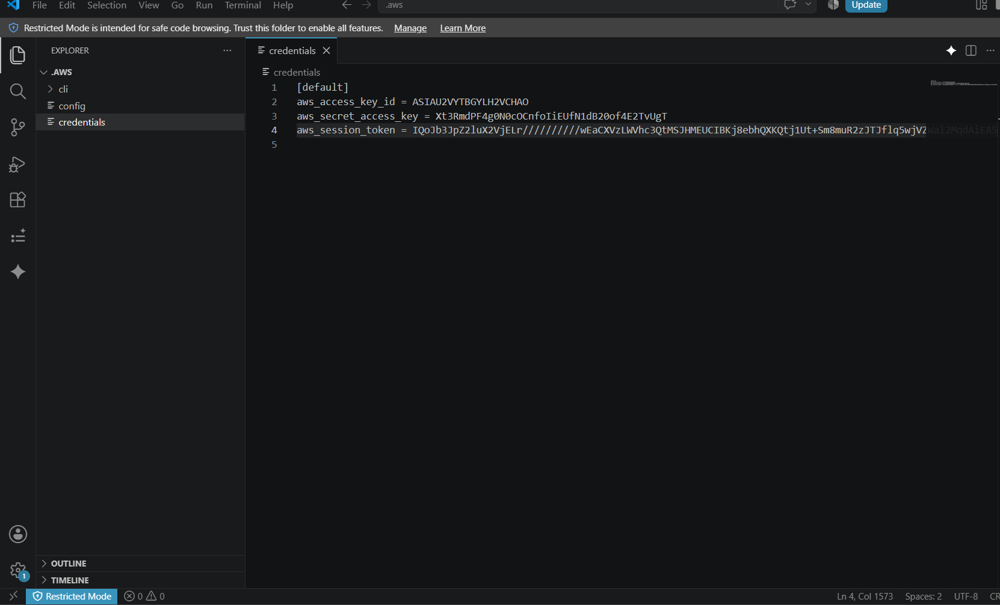
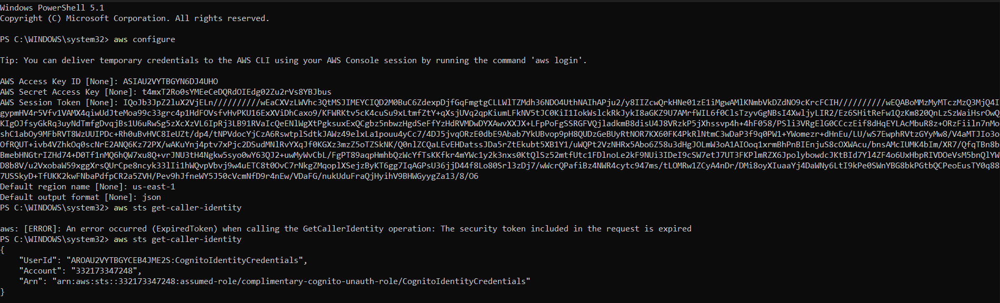
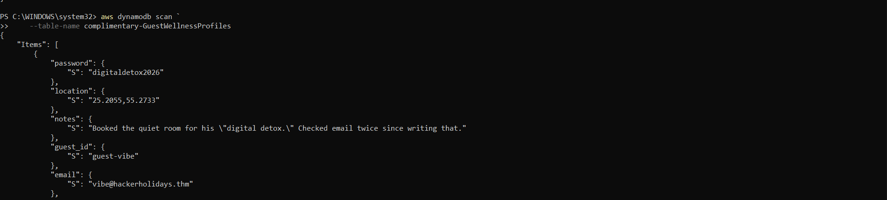
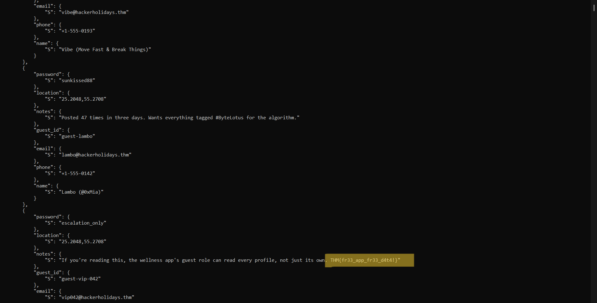

# Walkthrough – Byte Lotus: Complimentary
## Walkthrough

**Challenge Category:** Cloud Security (AWS)  
**Difficulty:** Easy  
**Platform:** TryHackMe - Hacker Holidays

---

# Challenge Summary

The Byte Lotus Wellness application provides a "frictionless" guest experience by automatically giving every visitor temporary AWS credentials through an Amazon Cognito Identity Pool. Although the application only displays the current guest's profile, the underlying IAM permissions are overly permissive.

Our objective is to obtain the temporary AWS credentials, abuse the IAM misconfiguration, enumerate the DynamoDB table, and recover the flag from another guest's profile.

---

# Step 1 - Explore the Application

Open the provided application.

```
http://complimentary-wellness-app-332173347248.s3-website-us-east-1.amazonaws.com/
```

The application immediately displays guest information without requiring any login.

This behavior suggests that the application is authenticating visitors automatically using temporary AWS credentials.

> 
>
> 

---

# Step 2 - Inspect the JavaScript

Open the browser Developer Tools (**F12**) and inspect the loaded JavaScript files.

One of the JavaScript files contains the following information:

```javascript
const IDENTITY_POOL_ID =
"us-east-1:836c0949-292d-485b-b532-52d5ca7bb688";

const AWS_REGION = "us-east-1";

const TABLE_NAME =
"complimentary-GuestWellnessProfiles";
```

The application uses **Amazon Cognito Identity Pools** to automatically obtain temporary AWS guest credentials.

It also reveals the DynamoDB table name.

Important findings:

- Identity Pool ID
- AWS Region
- DynamoDB table name

> 
>
> 

---

# Step 3 - Inspect Network Requests

Open the **Network** tab and refresh the page.

Notice requests being made to:

```
https://cognito-identity.us-east-1.amazonaws.com/
```

and

```
https://dynamodb.us-east-1.amazonaws.com/
```

The Cognito request returns temporary AWS credentials.

Example response:

```json
{
  "Credentials": {
      "AccessKeyId": "...",
      "SecretKey": "...",
      "SessionToken": "..."
  }
}
```

These credentials are sufficient to authenticate directly with AWS.

> 
>
> 

---

# Step 4 - Install AWS CLI

Download and install the AWS CLI.

Windows:

https://aws.amazon.com/cli/

Verify the installation.

```powershell
aws --version
```

> 
>
> 

---

# Step 5 - Configure the Temporary Credentials

Create the AWS credentials file.

Windows location:

```
C:\Users\<username>\.aws\credentials
```

Populate it using the values obtained from the Cognito response.

Example:

```ini
[default]
aws_access_key_id=ACCESS_KEY
aws_secret_access_key=SECRET_KEY
aws_session_token=SESSION_TOKEN
```

Create the configuration file.



```
C:\Users\<username>\.aws\config
```

```ini
[default]
region=us-east-1
output=json
```

---

# Step 6 - Verify Access

Verify the credentials by querying AWS STS.

```powershell
aws sts get-caller-identity
```

Successful output confirms that the temporary credentials are valid.

> 
>
> 

---

# Step 7 - Enumerate DynamoDB

The application frontend only performs:

```javascript
dynamodb.getItem(...)
```

which appears to retrieve only the current guest's record.

However, possessing the temporary AWS credentials allows us to directly interact with DynamoDB.

Attempt to enumerate the table:

```powershell
aws dynamodb scan --table-name complimentary-GuestWellnessProfiles
```

The command succeeds and returns every record stored in the table.

This indicates that the guest IAM role has permission to perform:

```
dynamodb:Scan
```

instead of being restricted to its own data.

> 
>
> 

---

# Step 8 - Recover the Flag

Among the returned records is another guest profile.

One entry contains the following note:

```text
If you're reading this, the wellness app's guest role can read every profile, not just its own.

THM{fr33_app_fr33_d4t4!}
```

Flag:

```
THM{fr33_app_fr33_d4t4!}
```

> 
>
> 

---

# Root Cause

The application trusted client-side logic to enforce authorization.

Although the frontend only requested the current guest's record using:

```javascript
dynamodb.getItem(...)
```

the IAM policy assigned to guest users permitted unrestricted table scanning.

Since authorization is enforced by IAM—not by frontend code—any user possessing the temporary credentials could invoke the AWS API directly and enumerate the entire DynamoDB table.

---

# Attack Flow

```
Application
      │
      ▼
Inspect JavaScript
      │
      ▼
Discover Cognito Identity Pool
      │
      ▼
Obtain Temporary AWS Credentials
      │
      ▼
Configure AWS CLI
      │
      ▼
Query DynamoDB Directly
      │
      ▼
Scan Entire Table
      │
      ▼
Read Another Guest's Record
      │
      ▼
Recover Flag
```

---

# Security Lessons

- Never rely on frontend code for authorization.
- Temporary AWS credentials must follow the principle of least privilege.
- Guest IAM roles should only be able to access their own data.
- Avoid granting `dynamodb:Scan` or unrestricted read permissions to guest identities.
- Use IAM condition keys to ensure each Cognito identity can access only its own records.

---

# Flag

```
THM{fr33_app_fr33_d4t4!}
```