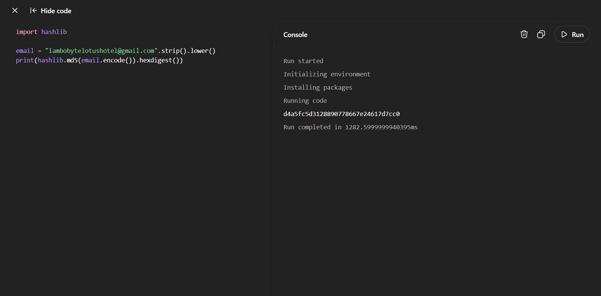
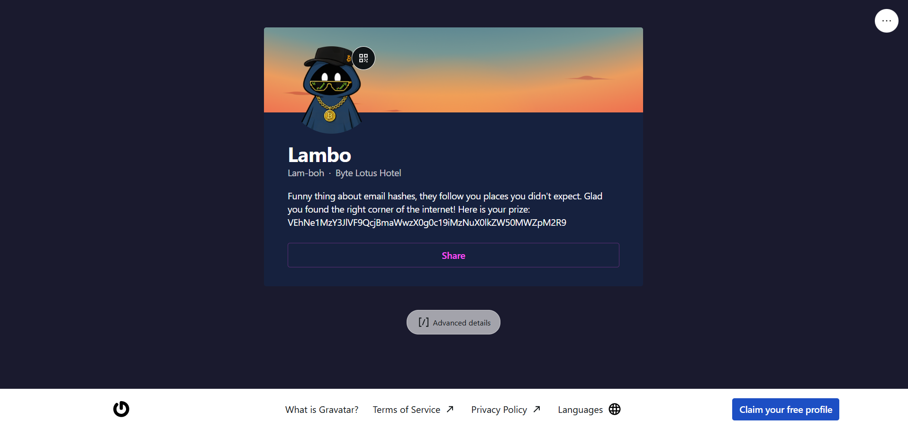
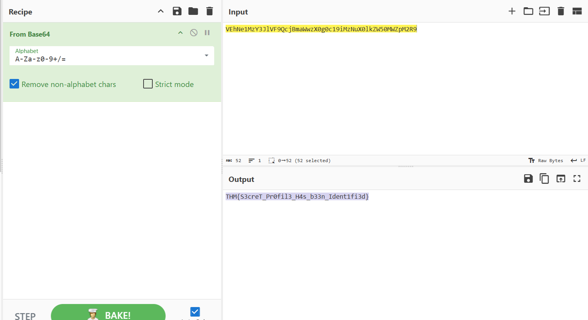

# Walkthrough – Byte Lotus: Overheard at Breakfast

## Challenge Information

**Category:** OSINT / Social Media / Hashing
**Difficulty:** Easy

### Challenge Description

A guest at the Byte Lotus Hotel overheard a conversation during breakfast and managed to capture a screenshot before one of the participants walked away.

The objective is to analyze the conversation, identify the clues left behind, locate a hidden online profile, and recover the flag.

---

# Enumeration

The provided screenshot contains a conversation between **Ponzi** and **Lambo**.

One message stands out:

> "I used to use this free tool that let me upload my profile and link other media accounts... Started with a G if I remember correctly."

Lambo also shares his email address:

```
lambobytelotushotel@gmail.com
```

These are the primary clues for solving the challenge.

---

## Screenshot

> 


---

# Hint Analysis

The challenge also provides a social media hint from **@0xMia**.

> "the breakfast crowd really said the quiet part out loud this morning 😭 y'all need to actually READ what they said, not just skim it"

This tells us that every detail in the conversation is important rather than just the obvious email address.

The important clues are:

* Email address:
  ```
  lambobytelotushotel@gmail.com
  ```
* A free profile service
* Starts with the letter **G**
* Allows users to link multiple social media accounts

These clues strongly point toward **Gravatar**.

---

# Hashing the Email

Gravatar profiles are identified using the **MD5 hash** of a user's lowercase email address.

Create a small Python script to generate the hash.

```python
import hashlib

email = "lambobytelotushotel@gmail.com".strip().lower()
print(hashlib.md5(email.encode()).hexdigest())
```

---

## Script Output

Running the script produces:

```
d4a5fc5d3128890778667e24617d7cc0
```

> 


---

# Finding the Hidden Profile

Append the generated hash to the Gravatar profile URL:

```
https://gravatar.com/d4a5fc5d3128890778667e24617d7cc0
```

The profile contains the following message:

> Funny thing about email hashes, they follow you places you didn't expect. Glad you found the right corner of the internet!

Along with an encoded string:

```
VEhNe1MzY3JlVF9QcjBmaWwzX0g0c19iMzNuX0lkZW50MWZpM2R9
```

---

## Screenshot

> 


---

# Decoding the Message

The recovered string is Base64 encoded.

Open **CyberChef** and use the **From Base64** recipe.

**Input**

```
VEhNe1MzY3JlVF9QcjBmaWwzX0g0c19iMzNuX0lkZW50MWZpM2R9
```

The decoded output is:

```
THM{S3creT_Pr0fil3_H4s_b33n_Ident1fi3d}
```

---

## Screenshot

> 


---

# Flag

```text
THM{S3creT_Pr0fil3_H4s_b33n_Ident1fi3d}
```

---

# Attack Summary

1. Analyze the breakfast conversation.
2. Identify the shared email address.
3. Notice the hint about a profile service starting with **G**.
4. Recognize the service as **Gravatar**.
5. Generate the MD5 hash of the email address.
6. Visit the corresponding Gravatar profile.
7. Recover the Base64-encoded string.
8. Decode it using CyberChef.
9. Obtain the flag.

---

# Key Learning Points

* Small details in conversations can reveal valuable OSINT clues.
* Gravatar profiles are publicly accessible using the MD5 hash of an email address.
* Email addresses can unintentionally expose public profiles across multiple services.
* Base64 encoding is an encoding scheme, **not encryption**, and can be easily reversed with tools such as CyberChef.
* Combining multiple reconnaissance techniques—conversation analysis, hashing, public profile discovery, and decoding—is a common workflow in OSINT investigations.