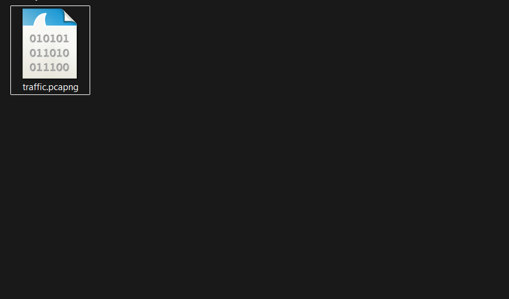
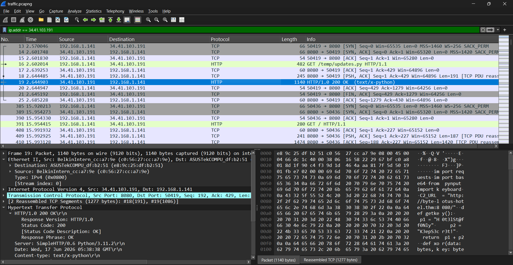
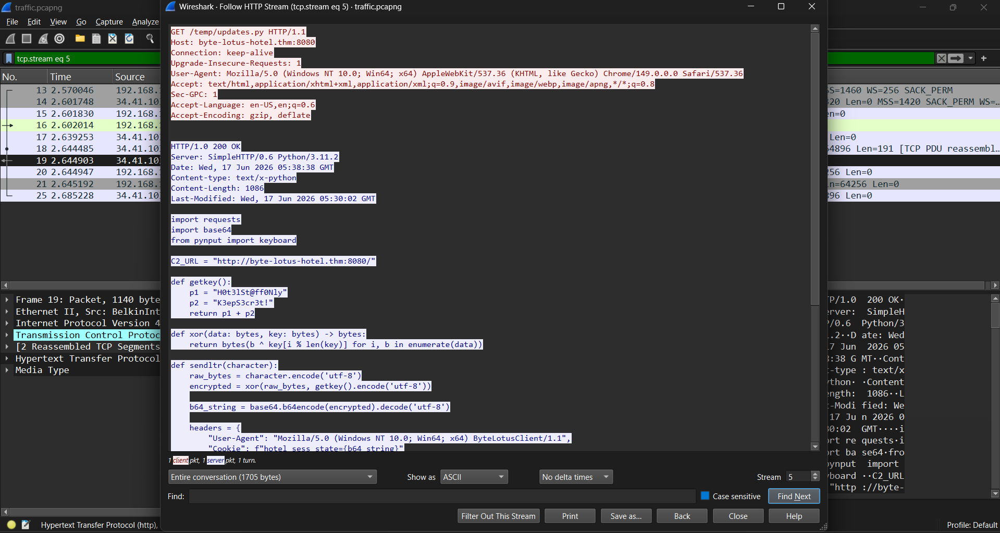
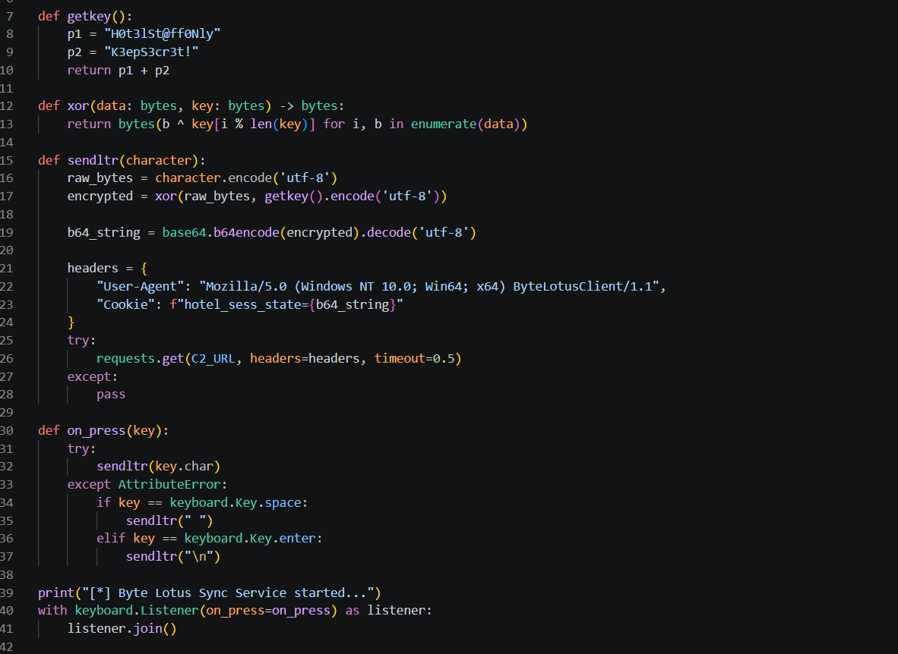
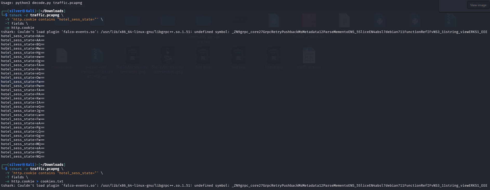
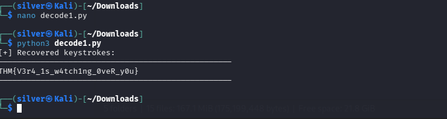

# Walkthrough – Byte Lotus: Packed Light

> **Challenge:** Covert Communication Channel
> **Category:** Network Forensics
> **Difficulty:** Easy

---

# Objective

Analyze the provided network capture to identify a covert communication channel, reconstruct the hidden data, and recover the flag.

---

# Tools Used

* Wireshark
* Python 3
* tshark

---

# Step 1 – Extract the Challenge Files

Download the provided ZIP archive and extract its contents.

The archive contains:

* `traffic.pcapng`

> 
>
> 

---

# Step 2 – Open the Packet Capture

Open `traffic.pcapng` using Wireshark.

Since the challenge description mentions suspicious communication occurring repeatedly, begin by looking for unusual external connections.

Applying the following display filter quickly isolates the suspicious traffic:

```wireshark
ip.addr == 34.41.103.191
```

This reveals a series of HTTP requests occurring at very regular intervals.

> 
>
> 

---

# Step 3 – Inspect the Suspicious HTTP Traffic

While examining the filtered packets, one request stands out.

The response advertises the following content type:

```
Content-Type: text/x-python
```

Instead of returning a normal web page, the server is sending a Python script.

Right-click the packet and choose:

```
Follow → HTTP Stream
```

> 
>
> 

---

# Step 4 – Analyze the Retrieved Python Script

Following the HTTP stream reveals the complete contents of a Python program named:

```
updates.py
```

The script is clearly a keylogger.

Important observations:

* Uses `pynput.keyboard` to capture every key press.
* Encrypts each captured character using a repeating XOR key.
* Base64-encodes the encrypted data.
* Sends the result inside an HTTP cookie named:

```
hotel_sess_state
```

to the C2 server:

```
http://byte-lotus-hotel.thm:8080/
```

The encryption key is generated by:

```python
def getkey():
    p1 = "H0t3lSt@ff0Nly"
    p2 = "K3epS3cr3t!"
    return p1 + p2
```

Resulting in:

```
H0t3lSt@ff0NlyK3epS3cr3t!
```

The exfiltration process is:

```
Keystroke
      ↓
UTF-8 Encoding
      ↓
XOR Encryption
      ↓
Base64 Encoding
      ↓
Stored in Cookie:
hotel_sess_state=<encoded_data>
      ↓
HTTP GET Request
```

> 
>
> 

---

# Step 5 – Recover the Hidden Data

The Python script revealed that every captured keystroke is stored inside the HTTP cookie named:

```text
hotel_sess_state
```

Instead of copying every cookie manually from Wireshark, use `tshark` to extract them in the exact order they were transmitted.

Run the following command:

```bash
tshark -r traffic.pcapng \
  -Y 'http.cookie contains "hotel_sess_state="' \
  -T fields \
  -e http.cookie > cookies.txt
```

This extracts every HTTP request containing the malicious cookie and saves the values to `cookies.txt`.

> 
>
> 

Next, decode each cookie by:

1. Extracting the `hotel_sess_state` value.
2. Base64 decoding it.
3. XOR decrypting it using the recovered key:

```text
H0t3lSt@ff0NlyK3epS3cr3t!
```

The following Python script automates the decoding process:

```python
import base64
from pathlib import Path

KEY = b"H0t3lSt@ff0NlyK3epS3cr3t!"


def xor_decrypt(data: bytes, key: bytes) -> bytes:
    return bytes(
        byte ^ key[index % len(key)]
        for index, byte in enumerate(data)
    )


def extract_cookie_value(line: str) -> str | None:
    marker = "hotel_sess_state="

    if marker not in line:
        return None

    value = line.split(marker, 1)[1]

    # Remove any additional cookies if present.
    return value.split(";", 1)[0].strip()


def main() -> None:
    cookie_file = Path("cookies.txt")

    if not cookie_file.exists():
        raise FileNotFoundError("cookies.txt was not found")

    recovered_characters: list[str] = []

    for line_number, line in enumerate(
        cookie_file.read_text(encoding="utf-8").splitlines(),
        start=1,
    ):
        encoded_value = extract_cookie_value(line)

        if not encoded_value:
            continue

        try:
            encrypted_data = base64.b64decode(encoded_value)
            decrypted_data = xor_decrypt(encrypted_data, KEY)
            recovered_characters.append(
                decrypted_data.decode("utf-8", errors="replace")
            )
        except Exception as error:
            print(f"[!] Could not decode line {line_number}: {error}")

    recovered_text = "".join(recovered_characters)

    print("[+] Recovered keystrokes:")
    print("-" * 50)
    print(recovered_text)
    print("-" * 50)


if __name__ == "__main__":
    main()
```

Run the script:

```bash
python decode1.py
```

The script reconstructs every captured keystroke in the correct order, revealing the text typed by the victim, including the challenge flag.

> 
>
> 


---

# Step 6 – Capture the Flag

Among the reconstructed keystrokes is the challenge flag:

```text
THM{V3r4_1s_w4tch1ng_0veR_y0u}
```

> 
>
> 

---

# Flag

```text
THM{V3r4_1s_w4tch1ng_0veR_y0u}
```

---

# Conclusion

The packet capture contained a covert keylogging operation disguised as normal HTTP traffic. The downloaded Python script revealed the entire exfiltration process, including the XOR encryption key and the use of Base64-encoded cookie values. By extracting, decoding, and decrypting those cookie values in order, the hidden keystrokes were reconstructed, revealing the challenge flag.
