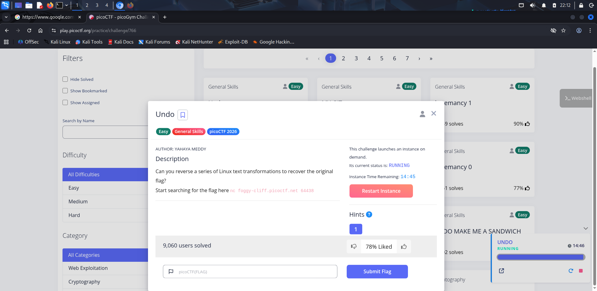
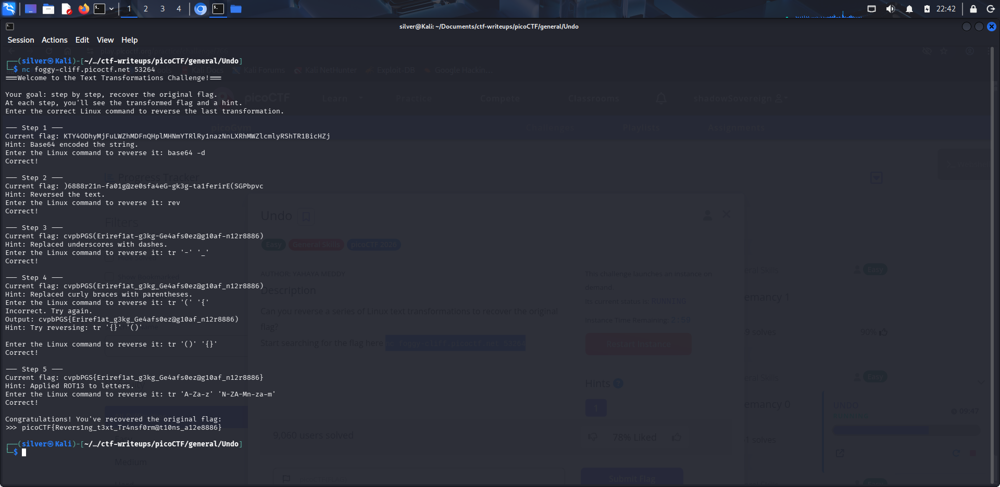
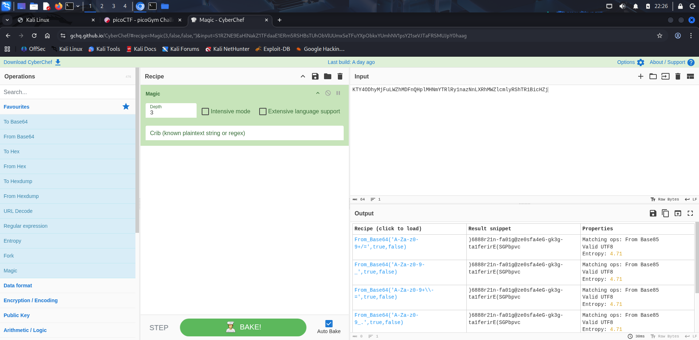
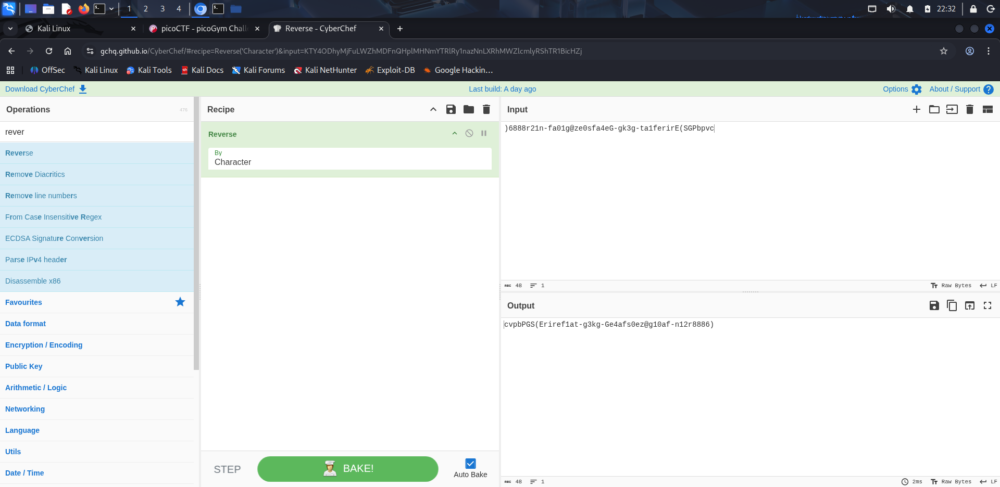
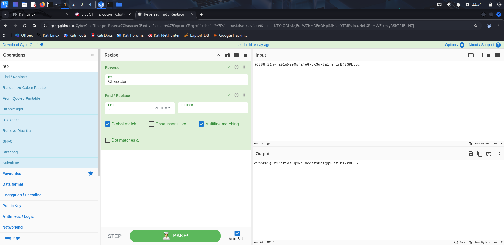
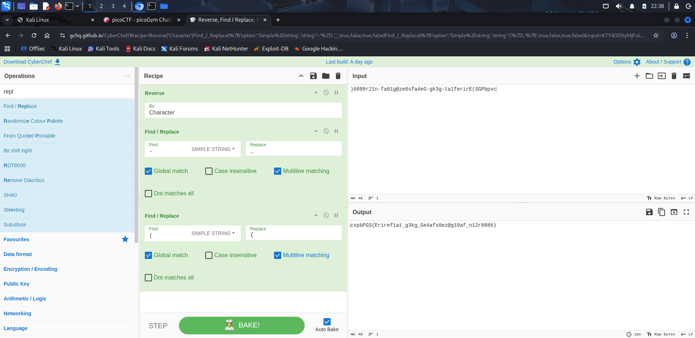
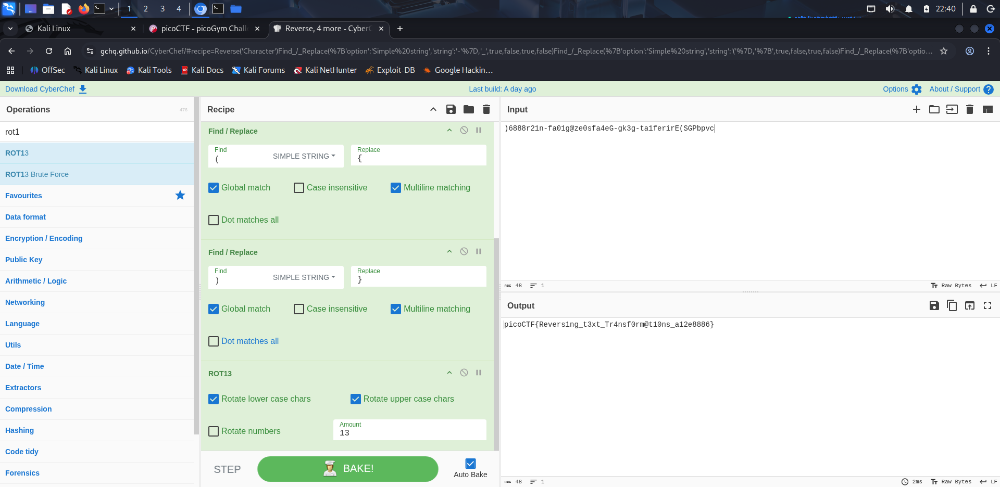
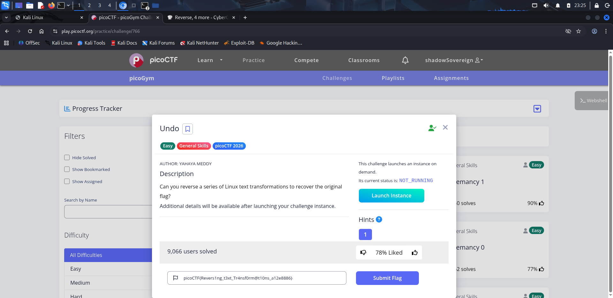

# 🧩 Undo - 🧩 Text Transformations


**Platform:** picoCTF  
**Category:** General  
**Difficulty:** Easy  

---

## 📜 Description
This challenge provided a network service where each step applied a transformation to a flag. The goal was to reverse each transformation step-by-step using Linux commands until the original flag was recovered.

---

## 🔍 Recon/ Initial Thoughts
- The challenge was accessed using nc foggy-cliff.picoctf.net 53264
- Each step showed a transformed string and a hint about the applied operation
- The idea was clearly to reverse transformations sequentially
- Likely transformations included: Base64, string reversal, character substitution, and ROT13

---

## 🧪 What I Tried
- First attempt: I tried using full commands with echo piping (e.g. echo "... " | base64 -d)
- This was rejected as an invalid input format by the challenge
- Realized the challenge expected only the Linux command itself, not a full pipeline
- After removing echo, the commands worked correctly

---

## ⚙️ Solution
Step-by-step reversal:

1.Base64 Decode
```bash
base64 -d
```
2.Reverse string
```bash
rev
```
3.Replace - with _
```bash
tr '-' '_'
```
4.Fix braces/parentheses mapping
```bash
tr '()' '{}'
```
5.ROT13 decode
```bash
tr 'A-Za-z' 'N-ZA-Mn-za-m'
```

---

## 🧠 Alternative Method (CyberChef)

I also solved the same transformations using CyberChef 🔗 https://gchq.github.io/CyberChef/, applying each operation step-by-step in order:
    Recipe Used:
```bash
From Base64 Decode → Reverse → Replace → ROT13
```
This confirmed the final output matches the terminal result

## 🚩 Flag
```bash
picoCTF{Revers1ng_t3xt_Tr4nsf0rm@t10ns_a12e8886}
```

---

## 🖼️ Screenshots / Evidence

### 🔹 Initial Connection


### 🔹 Each Step Output(Terminal)


### 🔹 Each Step Output(CyberChef)
  
  




### 🔹 Final Flag Output


---

## 💡 Key Takeaways
- In interactive CTF services (nc), you usually input commands only, not full pipelines
- CyberChef is very useful for visualizing transformations
- Many encoding challenges are just layered reversible operations
- Always read input format carefully before assuming shell behavior