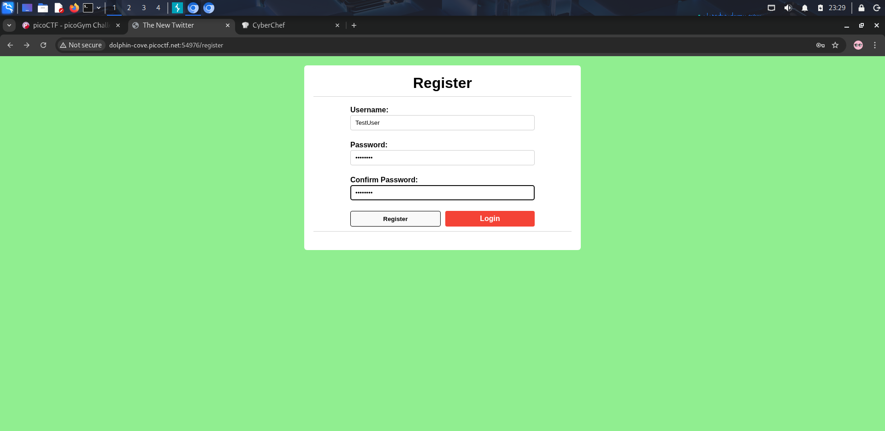
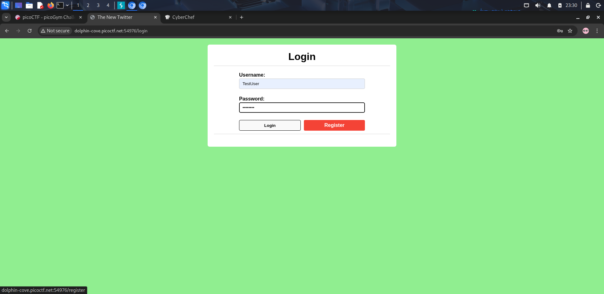
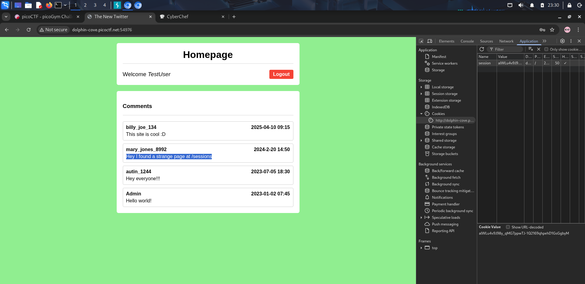
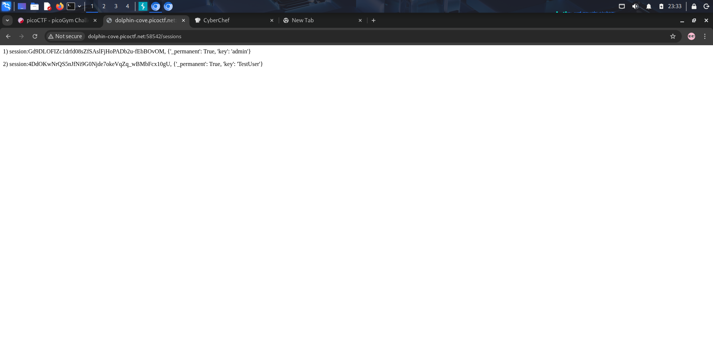
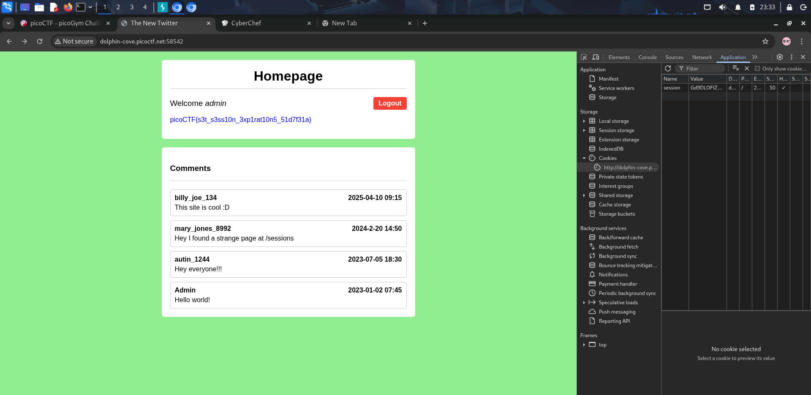

# 🧩 Old Sessions - 🧩 Session Misconfiguration


**Platform:** picoCTF  
**Category:** Web Exploitation  
**Difficulty:** Easy  

---

## 📜 Description
Proper session timeout controls are critical for securing user accounts. If a user logs in on a public or shared computer but doesn’t explicitly log out, and session expiration is misconfigured, the session may remain active indefinitely.

This allows an attacker to reuse the session and gain unauthorized access without credentials.

---

## 🔍 Recon/ Initial Thoughts
- The challenge clearly points to **session handling issues**
- Likely vulnerabilities:
  - Sessions not expiring
  - Session tokens exposed
- Checked for hidden endpoints or developer comments
- Found a suspicious hint pointing to `/session`

---

## 🧪 What I Tried
- Registered a normal user account to understand login behavior
- Explored the application manually for hidden routes
- Inspected page source for hints
- Found a comment referencing a **hidden session endpoint**
- Accessed it and discovered **active session data**
- Attempted session reuse via browser DevTools

---

## ⚙️ Solution

Step-by-step exploitation:

1. Register a User
```bash
Username: TestUser
Password: 12345678
```

2.Discover Hidden Endpoint
Found a comment:

```bash
"Hey, I found strange page at /session"
```

3.Access Session Page

```bash
/session
```

This exposed session data including an admin session token

4.Session Hijacking

- Open Developer Tools (F12)
- Navigate to Application → Cookies / Storage
- Replace current session token with the admin session

5.Gain Admin Access
- Refresh the page
- Logged in as admin
- Retrieved the flag 🎉

---

## 🧠 Alternative Method

Instead of manually editing cookies via DevTools:


- You could use tools like Burp Suite or Postman
- Intercept the request and replace the session cookie
- Forward the modified request to gain admin access

---

## 🚩 Flag
```bash
picoCTF{s3t_s3ss10n_3xp1rat10n5_51d7f31a}
```

---

🖼️ Screenshots / Evidence
### 🔹 Registration Page
 

### 🔹 Hidden Comment Discovery


### 🔹 Session Page Leak


### 🔹 Editing Session (DevTools)
-1.png) -2.png)

### 🔹 Admin Access / Flag


---

## 💡 Key Takeaways


- Session tokens are as sensitive as passwords
- Never expose session data via public endpoints
- Always implement:
 - Session expiration
 - Proper access control
- DevTools alone can be powerful enough for exploitation
- Small misconfigurations can lead to full account takeover

---
